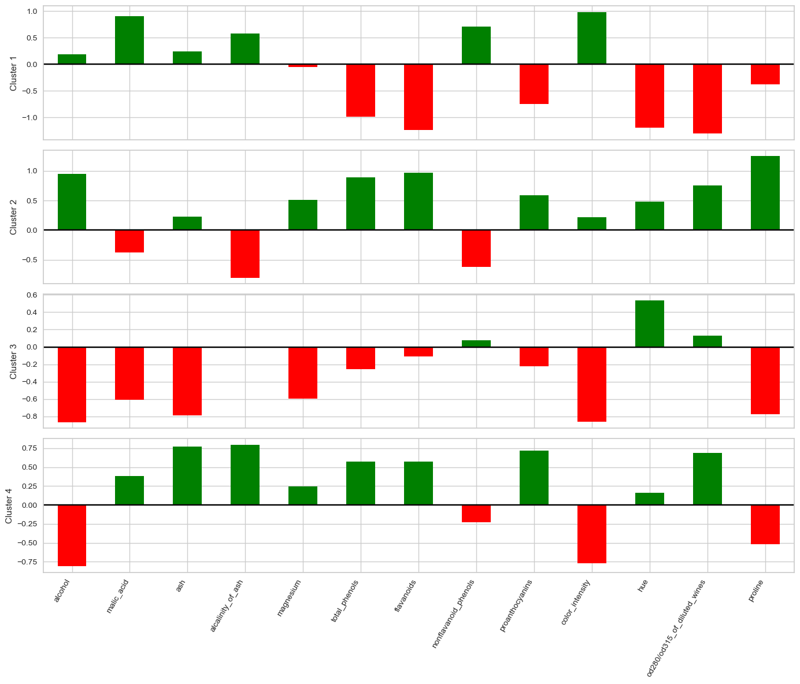
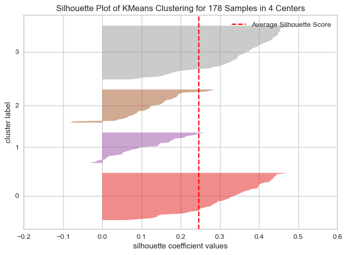

# Clusterização com KMeans em dataset de vinhos

## Objetivo do projeto

O presente projeto tem como objetivo aplicar em um dataset de vinhos algoritmos de Clusterização, mais especificamente o modelo de machine learning KMeans. Desta forma, pretende-se classificar os vinhos em grupos heterogêneos entre si de acordo com algumas características das composições químicas de cada amostra.

## Bibliotecas utilizadas

Segue uma lista com as bibliotecas em Python utilizadas no desenvolvimento e resolução do case.

- pandas
- numpy
- matplotlib
- sklearn
- yellowbrick
  
## Deployment

Este projeto foi todo desenvolvido utilizando o VS CODE. Portanto, se torna necessário a instalação deste ou de algum outro interpretador de código para o seu correto funcionamento. Em seguida, foram instaladas as extensões do Python e Jupyter Notebook dentro do VS CODE.

OBS: Versão do Python utilizada no projeto = 3.11.5

### Instalação das bibliotecas utilizadas

Feita as instalações dos requisitos base acima, agora é necessário instalar as bibliotecas, listadas no arquivo 'requirements.txt', que foram utilizadas no desenvolvimento do projeto. Para isso, executa-se no terminal do VS CODE, o comando abaixo.

```bash

pip install -r requirements.txt

```
Instaladas tais bibliotecas dentro do ambiente, agora pode-se rodar as linhas de código presentes no arquivos notebooks 'cluster_wines.ipynb'. Neste notebook estão todos os códigos desenvolvidos para a resolução deste projeto, desde as análises descritivas e estatísticas até a modelagem.

## Análise dos dados

Para avaliar a distribuição dos dados de cada uma das colunas presentes no dataset, plotou-se um gráfico do tipo Boxplot. Com este gráfico, é possível observar a mediana, quartis e principalmente a possível presença de outliers. Isto último tópico é muito importante para o modelo de KMeans a ser utilizado posteriormente, visto que este tipo de modelo é sensível a outliers.

- Gráfico Boxplot das colunas com os dados originais:


Percebe-se que os dados estão, na sua maior parte, "comprimidos" ou "achatados" no gráfico. Isto acontece pois existem colunas com escalas numéricas muito diferentes entre si. Este também é um problema ao rodar o modelo de KMeans, visto que, para o seu correto funcionamento, os dados numéricos precisam estar na mesma escala. Assim, para corrigir isso aplicou-se a função scale() da biblioteca scikit-learn importada anteriormente. Esta função irá transformar os dados de todas as colunas de tal modo a convertê-los para valores onde distribuição dos dados por coluna terá média igual a zero e desvio padrão igual a 1. Este processo é demonstrado a seguir,

- Gráfico Boxplot das colunas com os dados escalonados:


Avaliando-se o resultado acima, agora fica evidente a presença de outliers neste dataset, representados pelos círculos no gráfico. Afim de identificá-los de forma mais exata, utilizou-se do padrão Z-score, onde |Z-score| > 3.

Feitos os devidos cálculos, identificou-se um total de 10 linhas no dataset com presença de outliers. Como são poucas linhas, optou-se por excluí-los da análise.

## Modelling

Feito o tratamento dos dados numéricos e excluídos os outliers, agora é possível partir para a parte de desenvolvimento do modelo.

### Determinando o valor de K

Como não se sabe ao certo a quantidade de clusters em que se deseja dividir o dataset, é possível utilizar o chamado "Método do Cotovelo", no qual, utilizando a função kelbow_visualizer, da biblioteca yellowbrick importada anteriormente, temos um gráfico da variância em função do número de clusters. Com isto, é possível definir o ponto ótimo para o valor de k.

- Gráfico da variância em função da quantidade de clusters:


Analisando o gráfico acima, temos que o ponto ótimo se da com um valor de K = 4. É possível concluir isto pois, para valores maiores que 4, o score de variância dos dados diminui de forma não abrupta, se comparado a valores de K menores que 4, onde a redução da variância se da de forma mais drástica com o aumento gradual de clusters.

Outro fator importante é a interpretabilidade dos clusters. Quanto maior o valor de K, mais clusters, ou seja, em mais grupos serão divididos os dados. Avaliando do ponto de vista de negócio, isto pode ser ruim pois muitos grupos dificultam a própria interpretação das diferenças entre eles, ficando mais difícil também classificá-los e analisa-los.

### Interpretando os clusters

Definido o número de clusters, treinou-se o modelo definitivo de KMeans. Após isto, analisou-se os resultados de cada cluster obtido.

- Gráfico de barras de cada uma das características dos vinhos para cada cluster calculado pelo modelo KMeans:



Avaliando-se os resultados dos gráficos acima, percebe-se que o "Cluster 1" é o grupo que apresenta os vinhos com maiores índices em "malic_acid" e "color_intensity", mas com índices baixíssimos em "flavanoids" por exemplo. Já o "Cluster 2" tem índices altos em "alcohol" e "proline". O "Cluster 3" se caracteriza como o grupo com menor teor de "alcohol" e "proline", enquanto que o "Cluster 4" tem os valores mais elevados em "alcalinity_of_ash" e "proanthocyanins". Esta é uma das formas de avaliar as diferenças nas características detectadas pelo modelo para cada cluster definido.

Outra forma de interpretar os resultados da clusterização seria agrupar os dados originais (desconsiderando os outliers) por cluster. Assim, pode-se utilizar funções de agregação em cada uma das características (média, mediana, mínimo, máximo, etc.).

- Tabela com valores médios de cada característica para cada cluster:

<style type="text/css">
#T_f4ff1_row0_col0, #T_f4ff1_row1_col3, #T_f4ff1_row2_col3, #T_f4ff1_row3_col1, #T_f4ff1_row4_col3, #T_f4ff1_row5_col2, #T_f4ff1_row6_col2, #T_f4ff1_row7_col1, #T_f4ff1_row8_col2, #T_f4ff1_row9_col0, #T_f4ff1_row10_col2, #T_f4ff1_row11_col2, #T_f4ff1_row12_col3 {
  background-color: #ffffcc;
  color: #000000;
}
#T_f4ff1_row0_col1, #T_f4ff1_row1_col2, #T_f4ff1_row2_col1, #T_f4ff1_row3_col0, #T_f4ff1_row4_col1, #T_f4ff1_row5_col1, #T_f4ff1_row6_col1, #T_f4ff1_row7_col0, #T_f4ff1_row8_col1, #T_f4ff1_row9_col2, #T_f4ff1_row10_col1, #T_f4ff1_row11_col1, #T_f4ff1_row12_col1 {
  background-color: #800026;
  color: #f1f1f1;
}
#T_f4ff1_row0_col2 {
  background-color: #fc6430;
  color: #f1f1f1;
}
#T_f4ff1_row0_col3 {
  background-color: #fff1ab;
  color: #000000;
}
#T_f4ff1_row1_col0 {
  background-color: #fff9be;
  color: #000000;
}
#T_f4ff1_row1_col1 {
  background-color: #fff1a9;
  color: #000000;
}
#T_f4ff1_row2_col0 {
  background-color: #b40026;
  color: #f1f1f1;
}
#T_f4ff1_row2_col2 {
  background-color: #b20026;
  color: #f1f1f1;
}
#T_f4ff1_row3_col2 {
  background-color: #a80026;
  color: #f1f1f1;
}
#T_f4ff1_row3_col3 {
  background-color: #fd9e43;
  color: #000000;
}
#T_f4ff1_row4_col0, #T_f4ff1_row9_col3 {
  background-color: #fff7b7;
  color: #000000;
}
#T_f4ff1_row4_col2 {
  background-color: #fd9640;
  color: #000000;
}
#T_f4ff1_row5_col0 {
  background-color: #fee085;
  color: #000000;
}
#T_f4ff1_row5_col3 {
  background-color: #f33b25;
  color: #f1f1f1;
}
#T_f4ff1_row6_col0 {
  background-color: #fead4a;
  color: #000000;
}
#T_f4ff1_row6_col3 {
  background-color: #ed2e21;
  color: #f1f1f1;
}
#T_f4ff1_row7_col2 {
  background-color: #a10026;
  color: #f1f1f1;
}
#T_f4ff1_row7_col3 {
  background-color: #fff4b2;
  color: #000000;
}
#T_f4ff1_row8_col0 {
  background-color: #fedc7c;
  color: #000000;
}
#T_f4ff1_row8_col3 {
  background-color: #db141e;
  color: #f1f1f1;
}
#T_f4ff1_row9_col1 {
  background-color: #fa4a29;
  color: #f1f1f1;
}
#T_f4ff1_row10_col0 {
  background-color: #910026;
  color: #f1f1f1;
}
#T_f4ff1_row10_col3 {
  background-color: #820026;
  color: #f1f1f1;
}
#T_f4ff1_row11_col0 {
  background-color: #fd7435;
  color: #f1f1f1;
}
#T_f4ff1_row11_col3 {
  background-color: #bd0026;
  color: #f1f1f1;
}
#T_f4ff1_row12_col0 {
  background-color: #fffdc8;
  color: #000000;
}
#T_f4ff1_row12_col2 {
  background-color: #ffe691;
  color: #000000;
}
</style>
<table id="T_f4ff1">
  <thead>
    <tr>
      <th class="index_name level0" >cluster</th>
      <th id="T_f4ff1_level0_col0" class="col_heading level0 col0" >0</th>
      <th id="T_f4ff1_level0_col1" class="col_heading level0 col1" >1</th>
      <th id="T_f4ff1_level0_col2" class="col_heading level0 col2" >2</th>
      <th id="T_f4ff1_level0_col3" class="col_heading level0 col3" >3</th>
    </tr>
  </thead>
  <tbody>
    <tr>
      <th id="T_f4ff1_level0_row0" class="row_heading level0 row0" >alcohol</th>
      <td id="T_f4ff1_row0_col0" class="data row0 col0" >12.212000</td>
      <td id="T_f4ff1_row0_col1" class="data row0 col1" >13.778214</td>
      <td id="T_f4ff1_row0_col2" class="data row0 col2" >13.119592</td>
      <td id="T_f4ff1_row0_col3" class="data row0 col3" >12.364211</td>
    </tr>
    <tr>
      <th id="T_f4ff1_level0_row1" class="row_heading level0 row1" >malic_acid</th>
      <td id="T_f4ff1_row1_col0" class="data row1 col0" >1.896000</td>
      <td id="T_f4ff1_row1_col1" class="data row1 col1" >1.983929</td>
      <td id="T_f4ff1_row1_col2" class="data row1 col2" >3.380204</td>
      <td id="T_f4ff1_row1_col3" class="data row1 col3" >1.831316</td>
    </tr>
    <tr>
      <th id="T_f4ff1_level0_row2" class="row_heading level0 row2" >ash</th>
      <td id="T_f4ff1_row2_col0" class="data row2 col0" >2.418800</td>
      <td id="T_f4ff1_row2_col1" class="data row2 col1" >2.451250</td>
      <td id="T_f4ff1_row2_col2" class="data row2 col2" >2.420000</td>
      <td id="T_f4ff1_row2_col3" class="data row2 col3" >2.150263</td>
    </tr>
    <tr>
      <th id="T_f4ff1_level0_row3" class="row_heading level0 row3" >alcalinity_of_ash</th>
      <td id="T_f4ff1_row3_col0" class="data row3 col0" >21.656000</td>
      <td id="T_f4ff1_row3_col1" class="data row3 col1" >16.914286</td>
      <td id="T_f4ff1_row3_col2" class="data row3 col2" >21.255102</td>
      <td id="T_f4ff1_row3_col3" class="data row3 col3" >19.015789</td>
    </tr>
    <tr>
      <th id="T_f4ff1_level0_row4" class="row_heading level0 row4" >magnesium</th>
      <td id="T_f4ff1_row4_col0" class="data row4 col0" >92.760000</td>
      <td id="T_f4ff1_row4_col1" class="data row4 col1" >106.232143</td>
      <td id="T_f4ff1_row4_col2" class="data row4 col2" >98.653061</td>
      <td id="T_f4ff1_row4_col3" class="data row4 col3" >91.921053</td>
    </tr>
    <tr>
      <th id="T_f4ff1_level0_row5" class="row_heading level0 row5" >total_phenols</th>
      <td id="T_f4ff1_row5_col0" class="data row5 col0" >1.902800</td>
      <td id="T_f4ff1_row5_col1" class="data row5 col1" >2.855357</td>
      <td id="T_f4ff1_row5_col2" class="data row5 col2" >1.654286</td>
      <td id="T_f4ff1_row5_col3" class="data row5 col3" >2.460526</td>
    </tr>
    <tr>
      <th id="T_f4ff1_level0_row6" class="row_heading level0 row6" >flavanoids</th>
      <td id="T_f4ff1_row6_col0" class="data row6 col0" >1.663600</td>
      <td id="T_f4ff1_row6_col1" class="data row6 col1" >3.000179</td>
      <td id="T_f4ff1_row6_col2" class="data row6 col2" >0.796735</td>
      <td id="T_f4ff1_row6_col3" class="data row6 col3" >2.344474</td>
    </tr>
    <tr>
      <th id="T_f4ff1_level0_row7" class="row_heading level0 row7" >nonflavanoid_phenols</th>
      <td id="T_f4ff1_row7_col0" class="data row7 col0" >0.460800</td>
      <td id="T_f4ff1_row7_col1" class="data row7 col1" >0.286429</td>
      <td id="T_f4ff1_row7_col2" class="data row7 col2" >0.448776</td>
      <td id="T_f4ff1_row7_col3" class="data row7 col3" >0.299474</td>
    </tr>
    <tr>
      <th id="T_f4ff1_level0_row8" class="row_heading level0 row8" >proanthocyanins</th>
      <td id="T_f4ff1_row8_col0" class="data row8 col0" >1.308000</td>
      <td id="T_f4ff1_row8_col1" class="data row8 col1" >1.912679</td>
      <td id="T_f4ff1_row8_col2" class="data row8 col2" >1.124898</td>
      <td id="T_f4ff1_row8_col3" class="data row8 col3" >1.736842</td>
    </tr>
    <tr>
      <th id="T_f4ff1_level0_row9" class="row_heading level0 row9" >color_intensity</th>
      <td id="T_f4ff1_row9_col0" class="data row9 col0" >2.940000</td>
      <td id="T_f4ff1_row9_col1" class="data row9 col1" >5.616607</td>
      <td id="T_f4ff1_row9_col2" class="data row9 col2" >7.147347</td>
      <td id="T_f4ff1_row9_col3" class="data row9 col3" >3.193684</td>
    </tr>
    <tr>
      <th id="T_f4ff1_level0_row10" class="row_heading level0 row10" >hue</th>
      <td id="T_f4ff1_row10_col0" class="data row10 col0" >1.049040</td>
      <td id="T_f4ff1_row10_col1" class="data row10 col1" >1.063036</td>
      <td id="T_f4ff1_row10_col2" class="data row10 col2" >0.688571</td>
      <td id="T_f4ff1_row10_col3" class="data row10 col3" >1.060789</td>
    </tr>
    <tr>
      <th id="T_f4ff1_level0_row11" class="row_heading level0 row11" >od280/od315_of_diluted_wines</th>
      <td id="T_f4ff1_row11_col0" class="data row11 col0" >2.502400</td>
      <td id="T_f4ff1_row11_col1" class="data row11 col1" >3.168214</td>
      <td id="T_f4ff1_row11_col2" class="data row11 col2" >1.693469</td>
      <td id="T_f4ff1_row11_col3" class="data row11 col3" >2.980789</td>
    </tr>
    <tr>
      <th id="T_f4ff1_level0_row12" class="row_heading level0 row12" >proline</th>
      <td id="T_f4ff1_row12_col0" class="data row12 col0" >524.040000</td>
      <td id="T_f4ff1_row12_col1" class="data row12 col1" >1130.303571</td>
      <td id="T_f4ff1_row12_col2" class="data row12 col2" >621.673469</td>
      <td id="T_f4ff1_row12_col3" class="data row12 col3" >516.394737</td>
    </tr>
  </tbody>
</table>

Na tabela acima, quanto mais escura a cor, mais elevado o valor. Pornto, avaliando tais resultados com a média das características em cada cluster calculado pelo algoritmo KMeans, percebe-se que o cluster 1 é o cluster que apresenta,  o maior índice em "proline" e "alcohol". Enquanto que o cluster 2 tem em média o índice de "color_intesity" mais elevado se comparado aos demais clusters. Outro ponto interessante é que todos os clusters apresentam o índice "hue" em torno de 1, exceto o cluster 2, com 0.68. Isto também é uma característica que pode diferenciar este grupo dos demais.

Por último, exibiu-se o gráfico da métrica de Silhoueta "silhouette_score".

- Gráfico de "silhouette_score":



Avaliando o todo, tem-se um "silhouette_score" médio de mais ou menos 0.25. A métrica está positiva, o que é um bom sinal, pois isto nos diz que os pontos de um mesmo cluster definido pelo modelo estão mais próximos entre si do que dos pontos de outro cluster. Contudo não estão tão próximos assim, visto que o valor do silhouette está consideravelmente distante de 1 (lembrando que o valor máximo de silhouette_score é 1). Quanto mais próximo 1, quer dizer que mais próximos estão os pontos de um mesmo cluster e mais distantes eles estão dos outros clusters, o que demonstra uma homogeneidade marcante dentre as características do cluster e uma heterogeneidade clara se comparada aos demais grupos definidos.

Por fim, os grupos que apresentam melhor métrica de "silhouette" foram os clusters 0 e 3, com valores próximos a 0.45. Portanto são este grupos os mais homogêneos entre os pontos dentro deles e mais heterogêneos se comparados aos demais. Enquanto que o grupo com silhouette mais baixo foi o cluster 1, com valores mais próximos de 0.2.