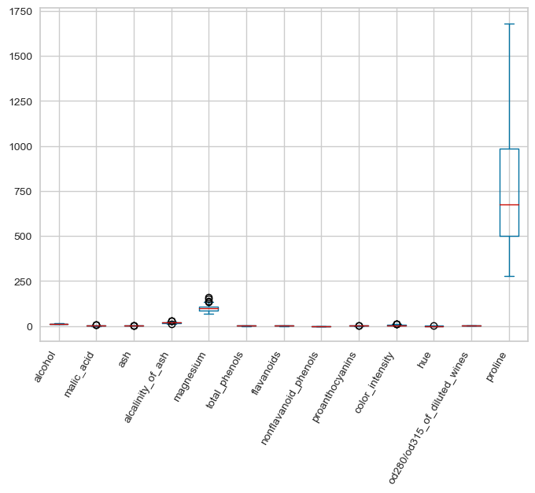
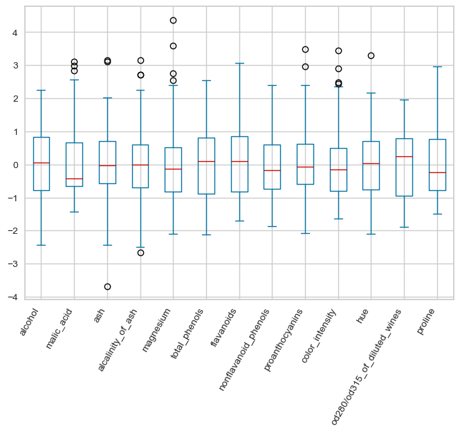
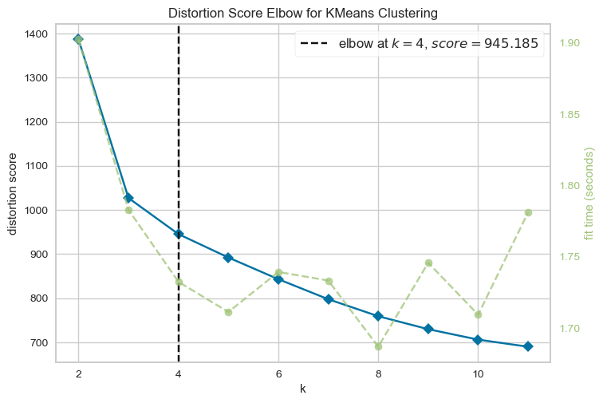

# Clusterização com machine learning em dataset de vinhos

## Objetivo do projeto

O presente projeto tem como objetivo aplicar algoritmos de machine learning, mais especificamente Clusterização, em um dataset de vinhos, classificando-os em grupos heterogêneos de acordo com algumas características das composições químicas de cada amostra.

## Bibliotecas utilizadas

Segue uma lista com as bibliotecas em Python utilizadas no desenvolvimento e resolução do case.
- pandas
- numpy
- matplotlib
- sklearn
- yellowbrick
  
## Deployment

Este projeto foi todo desenvolvido utilizando o VS CODE. Portanto, se torna necessário a instalação deste ou de algum outro interpretador de código para o seu correto funcionamento. Em seguida, foram instaladas as extensões do Python e Jupyter Notebook dentro do VS CODE.

OBS: Versão do Python utilizada no projeto = 3.11.5

### Instalação das bibliotecas utilizadas

Feita as instalações dos requisitos base acima, agora é necessário instalar as bibliotecas, listadas no arquivo 'requirements.txt', que foram utilizadas no desenvolvimento do projeto. Para isso, executa-se no terminal do VS CODE, o comando abaixo.

```bash

pip install -r requirements.txt

```
Instaladas tais bibliotecas dentro do ambiente, agora pode-se rodar as linhas de código presentes no arquivos notebooks 'cluster_wines.ipynb'. Neste notebook estão todos os códigos desenvolvidos para a resolução deste projeto, desde as análises descritivas e estatísticas até a modelagem.

## Análise dos dados



Isto acontece pois temos colunas com escalas numéricas muito diferentes. Este também é um problema ao rodar o modelo de KMeans, visto que para o seu correto funcionamento, os dados numéricos precisam estar na mesma escala. Assim, para corrigir isso aplicou-se a função scale() da biblioteca scikit-learn importada anteriormente. Esta função irá transformar os dados de todas as colunas de tal modo a convertê-los para valores onde distribuição dos dados por coluna terá média igual a zero e desvio padrão igual a 1. Este processo é demonstrado a seguir,

- Gráfico Boxplot das colunas do dataset



Avaliando-se o resultado acima, fica evidente a presença de outliers neste dataset, representados pelos círculos no gráfico. Afim de identificá-los de forma mais exata, utilizou-se do padrão Z-score, onde |Z-score| > 3.

Feitos os devidos cálculos, identificou-se um total de 10 linhas no dataset com presença de outliers. Como são poucas linhas, optou-se por excluí-los da análise.

## Modelling

Feito o tratamento dos dados numéricos e excluídos os outliers, agora é possível partir para a parte de desenvolvimento do modelo.

### Determinando o valor de K

- Gráfico da variância em função da quantidade de clusters



